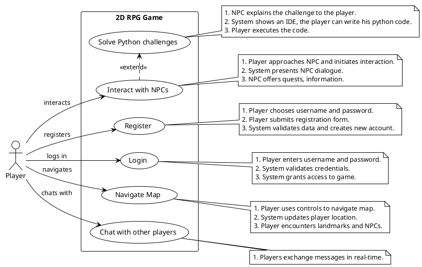
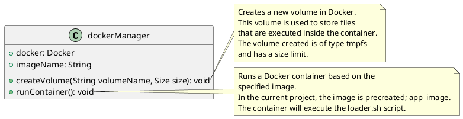
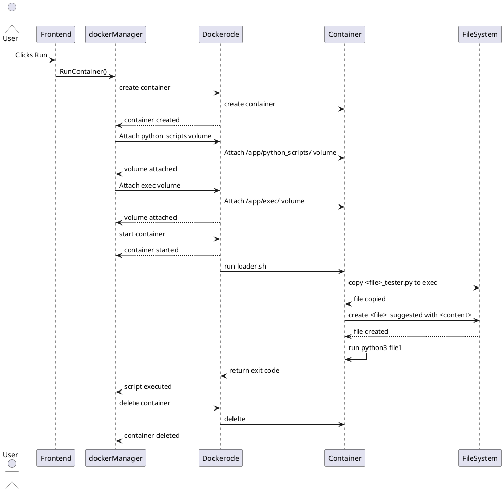
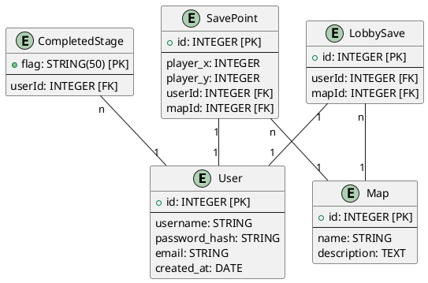
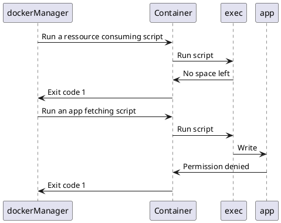

# Projet de Spécialité : INP Legends
## Authors
- [Dehbi Yakoub](https://github.com/dehbiy)
- [Elaasri Youssef](https://github.com/youssef-elaasri)
- [Benabdellah Achraf](https://github.com/benabach)

## Encadrant
- [Sebastien VIARDOT](https://gricad-gitlab.univ-grenoble-alpes.fr/viardots)

## Description
Ce document présente un compte rendu d'un projet de spécialité web. En bref, c'est un RPG 2D où le joueur doit résoudre des défis de programmation en Python. Nous présentons dans ce rapport un cahier des charges et notre implémentation correspondante.

# Table des matières

# Cahier des Charges
## Description du Jeu
<!-- Expliquer brièvement l'atmosphère du jeu -->
Dans "INP Legends", un jeu RPG-2D web qui se déroule dans l'atmosphère de Grenoble INP en l'an 2077, les joueurs sont plongés au cœur d'une épopée futuriste. L'intrigue se déploie autour d'une intelligence artificielle de pointe qui, ayant échappé à ses créateurs, sème le chaos dans le campus.
Conçu comme une expérience éducative immersive, ce jeu invite les joueurs à relever une série de défis de programmation ingénieux. L'objectif est double : neutraliser l'intelligence artificielle rebelle et restaurer la sérénité au sein de l'INP. À travers cette quête, "INP Legends" ne se contente pas de divertir ; il vise à aiguiser les compétences en programmation des joueurs tout en préservant l'équilibre entre éducation et divertissement.

## Cas d'Usages


## Diagrammes Séquentielles
Voici quelques diagrammes séquentielles pour les principales utilisations du jeu.


# Notre Avancement
Nous avons pu couvrir la majorité du cahier des charges. À l'heure actuelle, notre application est capable de générer des cartes dynamiquement, de permettre au joueur de se déplacer, et d'interagir avec des NPCs (personnages non-joueurs) qui peuvent proposer des défis Python, exécuter et évaluer ce code, et enfin sauvegarder la progression du joueur. Le joueur peut, entre autres, se déplacer entre les salles et discuter avec les personnages présents dans ces salles. 

# Architecture du Projet
Notre projet est constitué de deux grandes parties, un `FrontEnd` en simple HTML, CSS et JS, et un `BackEnd` en NodeJS.
## Frontend
<!-- Description du frontend ... -->
### HTML
### CSS
### Classes JS
### Images
### Génération Dynamique des MAPs
<!-- Let Youssef cook ... -->
### Tests
<!-- Expliquer la difficulté de tester un jeu -->

## Backend
<!-- Description du backend -->
### Technologies Utilisées
- Node.js : est l'environnement d'exécution principal de notre application côté serveur.
- Express.js : est le framework web utilisé dans app.js pour créer les API RESTful. Il gère les routes et les requêtes HTTP.
- Dockerode : est utilisé dans dockerManager.js pour interagir avec l'API Docker. Il permet de gérer les conteneurs Docker qui exécutent les défis Python soumis par les joueurs, assurant ainsi une isolation et une évaluation sécurisée du code.
- Sequelize : est utilisé pour interagir avec notre base de données MySQL. Nous avons choisi d'intégrer Sequelize à notre projet pour faciliter le déploiement.
- Socket.IO : gère les événements de jeu en direct, comme les déplacements des joueurs et les discussions en temps réel.
### Docker

**DockerManager** est essentiel pour l'exécution des fichiers Python et des tests Unit. Comme son nom l'indique, DockerManager est basé sur Docker et permet d'avoir un environnement isolé sur la machine pour exécuter des programmes.

<!-- diagramme de classes -->

<!-- Digramme de sequence -->



### Python Scripts
<!-- Explication de la gestion des scripts python -->

### Schéma de la Base de Données

<!-- Schéma de la DB -->


### Rest API
<!-- Add routes -->
### API Endpoints

| Méthode | Route                                 | Description                                                |
|---------|---------------------------------------|------------------------------------------------------------|
| POST    | /register                             | Crée un nouvel utilisateur                                 |
| POST    | /login                                | Authentifie un utilisateur et génère un token              |
| POST    | /api/users/:userId/change-password    | Change le mot de passe d'un utilisateur                    |
| POST    | /python                               | Fetch le corps du défis et le renvoie à l'utilisateur      |
| POST    | /python_script                        | Exécute un script Python à partir d'un fichier             |
| GET     | /api/users/:userId/load               | Charge l'état du jeu pour l'utilisateur spécifié           |
| POST    | /api/users/:userId/save               | Sauvegarde l'état du jeu pour l'utilisateur spécifié       |
| GET     | /api/users/:userId/loadLobby          | Charge la dernière carte avant la sortie du lobby          |
| POST    | /api/users/:userId/saveLobby          | Sauvegarde la carte actuelle avant l'entrée en lobby       |

### Multijoueur
<!-- Expliquer l'intégration des sockets -->
L'intégration des sockets dans notre application permet une communication en temps réel entre les joueurs, essentielle pour les fonctionnalités multijoueurs. Nous utilisons Socket.IO pour gérer cette communication bidirectionnelle de manière efficace et fiable.
Les événements de jeu en temps réel sont :
  - `registerNewPlayer` : Enregistre les données d'un joueur à sa connexion et notifie les autres joueurs sur la même carte. Ses données enregistrées en backend permetteront d'avoir **au maximum une seule session active par compte**.
  - `updatePosition` : Met à jour la position du joueur et informe les autres joueurs **sur la même carte**.
  - `changeMap` : Gère les changements de carte des joueurs et met à jour les salles correspondantes en notifiant les joueurs de chaque carte.
  - `sendMessage` : Permet aux joueurs d'une même salle d'envoyer des messages en temps réel.
  - `disconnect`: Lorsqu'un joueur se déconnecte, nous supprimons ses informations et notifions les autres joueurs de sa déconnexion.

### Securité
<!-- Ecrier comment docker pas sécurisé -->
La conteneurisation avec Docker constitue la principale couche de sécurité. En effet, cette dernière assure une isolation du code Python exécuté du système. Le conteneur lui-même est sécurisé : l'utilisateur n'a pas le droit d'écrire dans le conteneur, à l'exception du dossier dédié à l'exécution */app/exec*. Ce dossier même est limité en taille, ce qui garantit que les programmes exécutés ne consomment pas excessivement de ressources mémoire.

```js
createVolume(volumeName, size){
  const volumeOptions = {
                        Name: volumeName,
                        Driver: 'local',
                        DriverOpts: {
                            'type': 'tmpfs', //  Système de fichiers Unix temporaire
                            'device': 'tmpfs',
                            'o': `size=${size}` // La taille maximale
                        }
                    };
  // etc...
}
```

**Diagrame de sequence** pour les différents scènarios


Un script malveillant peut cependant exploiter une faille de sécurité[^1] dans Docker. Un contenair enregistre tous les logs dans un fichier *.json* et les stocke en mémoire tant que le contenaor est en vie. Une boucle infinie, par exemple, qui effectue des impressions peut consommer toute la mémoire de la machine hôte[^2]. Pour remédier à cela, nous limitons la taille du fichier de log à *10 MB*. De plus, tous les testes python impose une limite de temps de 10 secondes.

[^1]: Ce n'est pas une faille de sécurité, mais plutôt le comportement par défaut des conteneurs Docker.
[^2]: Nous avons sacrifié une machine pour découvrir ce bug. Merci à Achhraf :' )


```js
  runContainer(scriptName, path, content, volumeName) {
    const containerOptions = {
                Image: this.image,
                Cmd: [`${scriptName}_tester.py`, `${scriptName}_suggested.py`, content],
                AttachStdout: true,
                AttachStderr: true,
                HostConfig:{
                    LogConfig: {
                        Type: 'json-file',
                        config:{
                            'max-size': '10b', // 10o est le maximum pour un fichier log
                            'max-file': '1' // Nous avons un seul fichier log
                        }
                    },
                    Binds:  [
                        `${process.cwd()}/${path}:/app/python_scripts`,
                        `${volumeName}:/app/exec`
                    ]
                }
            };
  }
```


### Tests
<!-- Couverture de tests backend -->

# CI / CD
## Intégration 
L'intégration continue (CI) est mise en place pour garantir que le code de notre application est constamment testé et analysé pour des erreurs potentielles. Nous utilisons plusieurs étapes pour linting, tester, et construire notre application.

  - Linting : Nous vérifions la qualité du code avec des outils comme ESLint pour les fichiers JavaScript, HTMLHint pour les fichiers HTML, et CSSLint pour les fichiers CSS. Cela nous aide à maintenir un code propre et cohérent.

  - Tests : à compléter
  !!!!!!!!!!!!!!!!!!!!!!!!!!!!!!!!!!!!!!!!!!!!!!!!!!!!!!!!!!!!!!!!!!!!!!!!!!!!!!!!!!!!!!!!!!!!!!!!!!!!!!!!!!!!!!!!!!!!!!!!!!!!!!!!!!!!!!!!!!!!!!!!!!!!!!!!!!!!!!!!!!!!!!!!!!!!!!!!!!!!!!!!!!!!!!!!!!!!!!!!!!!!!!!!!!!!!!!!!!!!!!!

  - Build : Nous avons des étapes pour construire le backend (commentées pour l'instant) et le frontend de l'application. Cela permet de compiler notre code et de préparer les artefacts nécessaires pour le déploiement.

## Déploiement
Le déploiement de l'application n'a malheureusement pas pu être réalisé. Notre application exécute du code Python dans des conteneurs Docker, ce qui a rendu difficile la recherche d'un service gratuit d'hébergement. Nous avons trouvé des pistes de solutions, comme par exemple créer une image Docker de notre serveur Node.js et la déployer sur un service cloud, mais nous n'avions pas le temps de découvrir cette piste.

# Aspects d'amélioration

# Difficultées

# Prospection pour l'avenir


