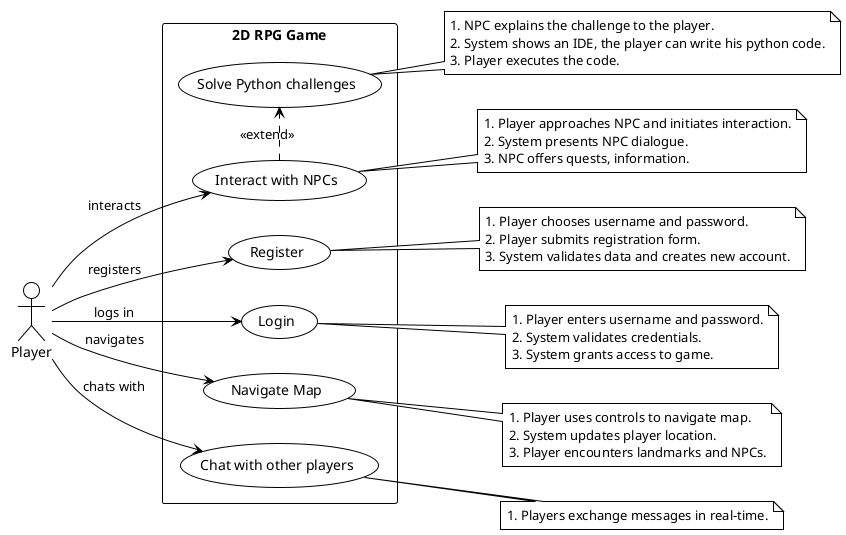
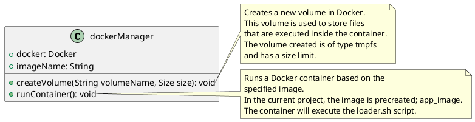
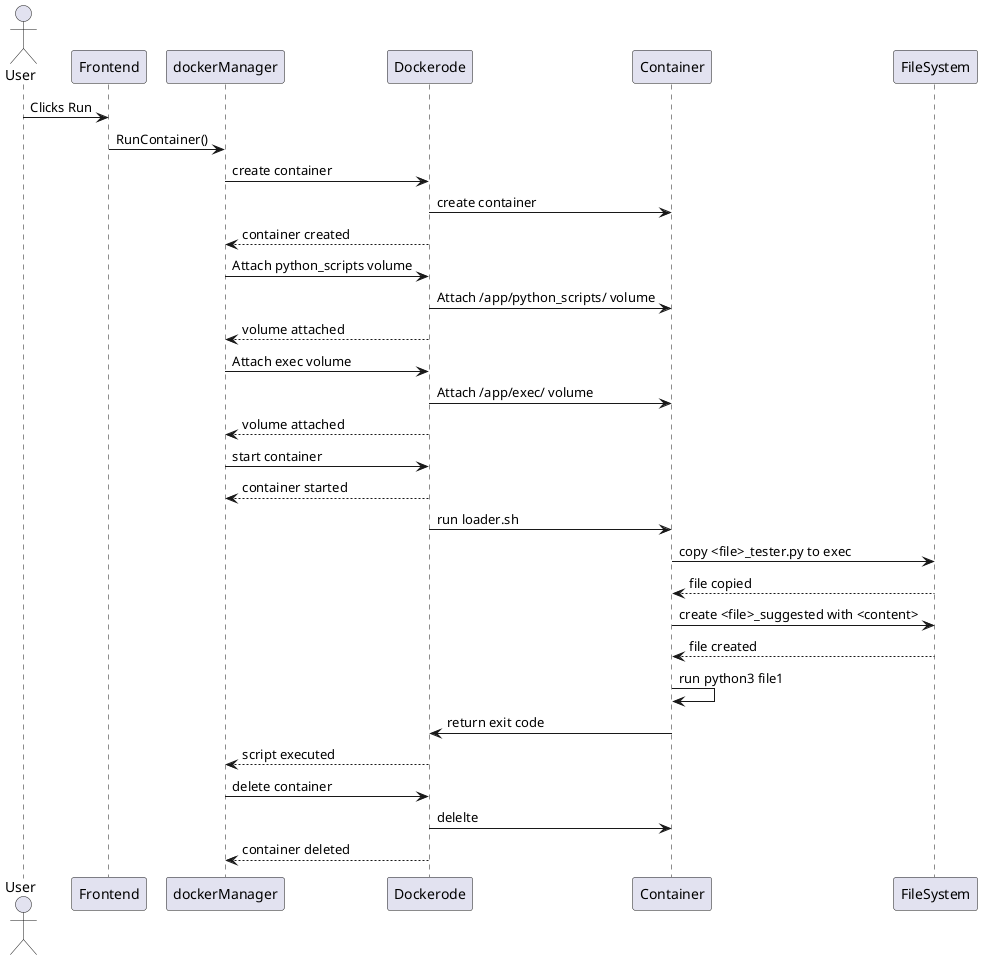
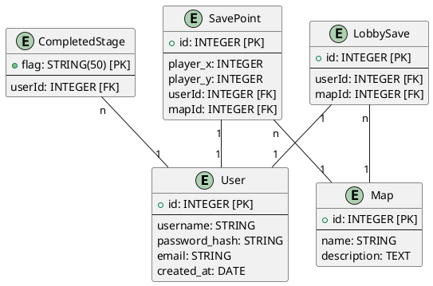
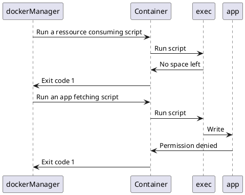

# Projet de Spécialité : INP Legends
## Authors
- [Dehbi Yakoub](https://github.com/dehbiy)
- [Elaasri Youssef](https://github.com/youssef-elaasri)
- [Benabdellah Achraf](https://github.com/benabach)

## Encadrant
- [Sebastien VIARDOT](https://gricad-gitlab.univ-grenoble-alpes.fr/viardots)

## Description
Ce document présente un compte rendu d'un projet de spécialité web. En bref, c'est un RPG 2D où le joueur doit résoudre des défis de programmation en Python. Nous présentons dans ce rapport un cahier des charges et notre implémentation correspondante.

# Table des matières

# Cahier des Charges
## Description du Jeu
<!-- Expliquer brièvement l'atmosphère du jeu -->
Dans "INP Legends", un jeu RPG-2D web qui se déroule dans l'atmosphère de Grenoble INP en l'an 2077, les joueurs sont plongés au cœur d'une épopée futuriste. L'intrigue se déploie autour d'une intelligence artificielle de pointe qui, ayant échappé à ses créateurs, sème le chaos dans le campus.
Conçu comme une expérience éducative immersive, ce jeu invite les joueurs à relever une série de défis de programmation ingénieux. L'objectif est double : neutraliser l'intelligence artificielle rebelle et restaurer la sérénité au sein de l'INP. À travers cette quête, "INP Legends" ne se contente pas de divertir ; il vise à aiguiser les compétences en programmation des joueurs tout en préservant l'équilibre entre éducation et divertissement.

## Cas d'Usages


## Diagrammes Séquentielles
Voici quelques diagrammes séquentielles pour les principales utilisations du jeu.


# Notre Avancement
Nous avons pu couvrir la majorité du cahier des charges. À l'heure actuelle, notre application est capable de générer des cartes dynamiquement, de permettre au joueur de se déplacer, et d'interagir avec des NPCs (personnages non-joueurs) qui peuvent proposer des défis Python, exécuter et évaluer ce code, et enfin sauvegarder la progression du joueur. Le joueur peut, entre autres, se déplacer entre les salles et discuter avec les personnages présents dans ces salles. 

# Architecture du Projet
Notre projet est constitué de deux grandes parties, un `FrontEnd` en simple HTML, CSS et JS, et un `BackEnd` en NodeJS.
## Frontend
## Aperçu
Le frontend de INP Legends est conçu pour offrir une expérience interactive et fluide aux joueurs. Il intègre plusieurs composants clés, notamment une fenêtre de jeu, une fonctionnalité de chat, un panneau de profil joueur et un système d'authentification. L'application utilise des technologies web modernes et des bibliothèques pour assurer une interface utilisateur réactive et engageante.

## Technologies Utilisées
- **HTML5** pour la structuration de la page web.
- **CSS3** avec des bibliothèques externes comme Pico.css et Font Awesome pour le style.
- **JavaScript** pour le script côté client, incluant divers modules pour gérer la logique du jeu, l'authentification, le chat et le profil joueur.

## Structure du Projet

### Fichier `index.html`
Le fichier `index.html` constitue la base de l'application et inclut les éléments suivants :
- **En-tête (`<head>`)** : comprend les liens vers les feuilles de style externes et les polices.
- **Corps (`<body>`)** :
  - **Fenêtre de jeu** : contient le canvas pour afficher le jeu, un panneau de chat, et divers boutons de contrôle (déconnexion, profil, sauvegarde, plein écran).
  - **Panneau de profil** : une section cachée par défaut, affichant les informations du joueur et permettant la modification du mot de passe.
  - **Modal d'authentification** : une fenêtre modale pour la connexion et l'inscription des utilisateurs.

### Feuilles de Style
- `src/styles.css` : contient les styles personnalisés pour l'application.

### Scripts JavaScript
- **Bibliothèques externes** : `socket.io`, `jQuery`, et `Ace Editor`.
- **Scripts personnalisés** :
  - `src/socket.js` : gère la connexion WebSocket.
  - `src/authentication.js` : gère les fonctions d'authentification, comme la connexion et l'inscription.
  - `src/chatManager.js` : gère les fonctionnalités de chat en temps réel.
  - `src/playerProfile.js` : gère l'affichage et la mise à jour des informations du profil joueur.
  - `src/IDE.js` : gère l'IDE intégré pour les fonctionnalités de développement.
  - `src/Utils.js` : contient des fonctions utilitaires.
  - `src/DirectionInput.js` : gère les entrées de direction pour le contrôle du jeu.
  - `src/GameObject.js`, `src/Person.js`, `src/NPC.js`, `src/Sprite.js`, `src/OverworldMap.js`, `src/OverworldEvent.js`, `src/MainWorld.js`, `src/init.js` : gèrent les différents aspects et objets du jeu.

## Fonctionnalités Principales
- **Fenêtre de Jeu** : affiche le jeu et permet l'interaction avec le joueur.
- **Chat** : permet aux joueurs de communiquer en temps réel.
- **Profil Joueur** : affiche les informations du joueur et permet la modification du mot de passe.
- **Authentification** : système de connexion et d'inscription sécurisé.
- **Contrôles du Jeu** : inclut des boutons pour sauvegarder le jeu, passer en plein écran, et se déconnecter.
- **chalenges python** : affiche un IDE pour permettre à l'utilisateur de saisir un code python.

## Logique du Jeu

### Affichage et Navigation
Le jeu est affiché sur un canvas HTML, et la navigation se fait à l'aide des touches directionnelles du clavier. Le joueur peut se déplacer sur la carte, qui est rendue à l'aide de la classe `OverworldMap`.

- **`OverworldMap.js`** : gère la carte du monde. Elle charge les tuiles de la carte et place les objets et les personnages (joueurs et NPC) à leurs positions initiales.
- **`Sprite.js`** : gère les sprites, c'est-à-dire les images des personnages et des objets animés. Elle prend en charge l'animation et le rendu des sprites sur le canvas.
- **`DirectionInput.js`** : capture les entrées directionnelles du clavier et les traduit en mouvements pour le personnage principal.

### Interaction avec les NPC
Les joueurs peuvent interagir avec les NPC (Personnages Non Joueurs) en s'approchant d'eux et en appuyant sur une touche d'interaction "espace".

- **`Person.js`** : représente un personnage, joueur ou NPC. Elle gère les propriétés de base comme la position, la vitesse et les méthodes de déplacement.
- **`NPC.js`** : hérite de `Person.js` et ajoute des fonctionnalités spécifiques aux NPC, comme les dialogues et les quêtes.

- **`GameObject.js`** : représente un objet dans le jeu. Il peut s'agir d'un objet interactif avec lequel le joueur peut interagir pour obtenir des informations ou déclencher des événements.

- **`OverworldEvent.js`** : gère les événements dans le monde du jeu, comme les interactions avec les objets ou les NPC.

- **`IDE.js`** : gère l'IDE intégré où les joueurs peuvent résoudre des défis de programmation en Python. Il utilise `Ace Editor` pour fournir une interface de codage conviviale.

### Gestion des Objets
Les joueurs peuvent interagir avec des objets dans le monde du jeu, il y a deux type d'objet dans le jeu : 
- ***les objets "mounted***" : ils sont des objets qui représente des murs, l'utilisateur ne peut pas les traverser ( ex : mur, table ... ) 
- ***les objets qui sont pas "mounted"*** : ils sont des objet qu'on peut les traverser (ex : sol, autres joueurs, ...) 

### Défis Python.
Après une interaction avec des NPC, si l'utilisateur à le droit de jouer le chalenge corespond à ce NPC, un IDE se lance dans le jeux et permet au joueur de saisir un code representant la solution du joueur.
Si l'utilisateur n'a pas le droit de jouer le chalenge ( il faut résoudre des chalenges avant ), l'interaction avec le NPC sera déffirente et l'IDE ne se lance pas.

En effet, les interactio avec les NPC se changent en progressant dans le jeux.

### Initialisation et Monde Principal
Le jeu est initialisé et configuré à l'aide des scripts suivants :

- **`init.js`** : initialise le jeu en configurant les paramètres de base et en lançant le moteur de jeu.
- **`MainWorld.js`** : gère le monde principal du jeu, en coordonnant les différentes cartes et en contrôlant les transitions entre elles.

## Algorithme d'affichage des objets et des NPC

## Fonction `updateMap()`

La fonction `updateMap()` est chargée de vérifier si le prochain déplacement du joueur devrait déclencher le changement de carte. Si tel est le cas, la fonction gère différents cas de changement de carte.

Elle commence par récupérer la nouvelle carte et les nouvelles coordonnées à partir de la table de hachage `changeMap`, qui associe les coordonnées du joueur à la carte et aux coordonnées de destination.

Si aucune nouvelle carte n'est trouvée pour les coordonnées actuelles du joueur, la fonction se termine.

Ensuite, la fonction met à jour la carte et la position du joueur en appelant une fonction `updateMapAndPlayerPosition()`, qui prend en paramètre le nom de la nouvelle carte et les nouvelles coordonnées du joueur. Cette fonction change également la carte affichée et déplace le joueur aux nouvelles coordonnées.

Avant de changer de carte, la fonction peut également sauvegarder la partie et émettre un message au serveur via un socket pour informer les autres joueurs du changement de carte. Cette logique est encapsulée dans une fonction `saveAndEmit()`.

La fonction principale utilise des blocs `try` et `catch` pour gérer les erreurs potentielles. Si une erreur se produit lors du changement de carte, elle est capturée et affichée dans la console.

Les différents cas de changement de carte sont traités de la manière suivante :

- Si le joueur se déplace vers le hall (`lobby`), la fonction appelle `handleLobbyEntry()` pour gérer l'entrée dans le hall, en passant le nom de la carte actuel, les nouvelles coordonnées, la fonction de mise à jour de la carte et la fonction de sauvegarde et d'émission de message.
  
- Si le joueur quitte le hall (`lobby`), la fonction appelle `handleLobbyExit()` pour gérer la sortie du hall, en passant la fonction de mise à jour de la carte et la fonction de sauvegarde et d'émission de message.

- Pour tous les autres cas de changement de carte, la fonction appelle simplement `updateMapAndPlayerPosition()` pour mettre à jour la carte et la position du joueur, puis sauvegarde et émet un message pour informer les autres joueurs du changement de carte.


### Fonction `startGameLoop()`

La fonction `startGameLoop()` représente le cœur de la boucle de jeu. Elle est responsable de l'actualisation et du rendu de tous les éléments visibles à l'écran, y compris les objets et les PNJ.

Elle commence par effacer le canevas à chaque itération pour éviter l'accumulation de frames indésirables, assurant ainsi un rendu propre et fluide.

Ensuite, elle met à jour la carte de jeu en appelant la méthode `updateMap()` de l'objet `window.currentMap`.

Après la mise à jour de la carte, la fonction procède à la mise à jour de chaque objet de jeu, chaque PNJ et chaque joueur. Ces mises à jour peuvent inclure des calculs de déplacement, des interactions avec d'autres éléments du jeu ou des changements d'état en réponse à des événements.

Une fois que tous les éléments ont été mis à jour, la fonction commence le processus de rendu en dessinant les objets de jeu, les PNJ et les joueurs sur le canevas. Pour ce faire, elle parcourt les listes d'objets et utilise la méthode `draw()` de chaque objet pour les dessiner à leur position actuelle.

Les objets et PNJ "supérieurs", c'est-à-dire ceux qui doivent être rendus au-dessus des autres éléments, sont également pris en charge. Ils sont dessinés après les autres éléments et sont stockés dans un tableau `window.upperObjects` pour un rendu ultérieur.

### Méthode `draw(ctx)` de la classe `Sprite`

La méthode `draw(ctx)` est chargée de dessiner un objet ou un PNJ sur le canevas en fonction de sa position et de son état actuels par rapport au joueur principal.

Elle commence par vérifier si l'objet doit être dessiné en fonction de sa position par rapport au joueur principal et de l'état de rendu actuel. Si l'objet doit être rendu, la méthode calcule les coordonnées de rendu en fonction de la position du joueur principal et dessine l'image correspondante sur le canevas en utilisant le contexte de rendu `ctx`.

La méthode `draw()` gère également la logique d'affichage des différentes images en fonction de l'état de l'objet ou du PNJ. Par exemple, elle peut changer l'image affichée pour refléter le mouvement, l'action ou l'état actuel de l'objet.

Si l'objet doit être dessiné au-dessus des autres éléments, il est ajouté à un tableau `window.upperObjects` pour un rendu ultérieur.


## Algorithme de Génération Dynamique des Maps

### Fonction `init(userId)`

La fonction `init()` est responsable de l'initialisation du jeu pour un utilisateur donné. Elle réalise les opérations suivantes :

1. **Chargement de l'état du jeu** :
   - Utilise la fonction `loadGame(userId)` pour charger l'état sauvegardé du jeu pour l'utilisateur spécifié.

2. **Initialisation du joueur** :
   - Si un état de jeu sauvegardé existe, il est utilisé pour initialiser le joueur (`window.Player`). Les informations incluent :
     - Position X et Y du joueur.
     - Identifiant de l'utilisateur.
     - Drapeaux d'histoire (stages complétés).

3. **Création et préparation des objets et des cartes** :
   - Appelle `util.createAllObjects()` pour créer tous les objets nécessaires.
   - Utilise `util.prepareMAP()` pour préparer les différentes cartes en fournissant le nom de la carte et le chemin vers l'image de la carte.

4. **Démarrage de la carte** :
   - Démarre la carte initiale en appelant `this.startMap()` avec la carte sauvegardée dans l'état de jeu.

5. **Capture des entrées directionnelles et initialisation du multijoueur** :
   - Initialise la capture des entrées directionnelles avec `new DirectionInput()`.
   - Initialise le socket pour le multijoueur avec `initializeSocket()`.

6. **Démarrage de la boucle de jeu** :
   - Démarre la boucle de jeu en appelant `this.startGameLoop()`.

### Fonction `prepareMAP(mapName, src)`

La fonction `prepareMAP()` est chargée de préparer une carte spécifique. Voici le processus :

1. **Chargement de l'image de la carte** :
   - Crée une nouvelle image et définit son chemin source (`src`).
   - Assure que l'image est chargée de manière asynchrone avec `crossOrigin` pour éviter les problèmes de politique de même origine.
   - Une fois l'image chargée, appelle `util.crateMap(mapName, levelImage)`.

### Fonction `crateMap(mapName, image)`

La fonction `crateMap()` convertit une image de carte en objets de jeu placés sur la carte. Voici le processus :

1. **Création d'un canevas hors écran** :
   - Crée un canevas hors écran (`offScreenCanvas`) et obtient son contexte (`offCtx`).

2. **Dessin de l'image sur le canevas hors écran** :
   - Définit les dimensions du canevas pour correspondre à celles de l'image.
   - Dessine l'image sur le canevas hors écran.

3. **Extraction des données d'image** :
   - Obtient les données d'image (`imageData`) du canevas.

4. **Parcours des pixels de l'image** :
   - Parcourt chaque pixel de l'image pour lire les valeurs de couleur rouge, verte et bleue (RGB).

5. **Création d'objets de carte** :
   - En fonction des valeurs RGB des pixels, ajoute des objets à la carte en appelant `this.addObject()` avec les paramètres appropriés :
     - `mapName` : Nom de la carte.
     - `window.<ObjectName>` : Objet correspondant aux couleurs RGB.
     - `name` : Nom unique de l'objet.
     - `x, y` : Coordonnées de l'objet.

   - Les objets ajoutés dépendent des couleurs spécifiques des pixels, représentant différents éléments de la carte (murs, sols, meubles, etc.).

### Fonction `addObject(mapName, object, name, x, y)`

La fonction `addObject()` ajoute un objet spécifique à une carte. Elle prend les paramètres suivants :

- `mapName` : Nom de la carte.
- `object` : Objet à ajouter.
- `name` : Nom unique de l'objet.
- `x, y` : Coordonnées de l'objet sur la carte.

Cette fonction est appelée dans `crateMap()` pour chaque pixel correspondant à un objet.


### Tests
<!-- Expliquer la difficulté de tester un jeu -->

## Backend
### Structure
- **Répertoires principaux** :
  - **images/** : Contient les fichiers d'image utilisés par l'application.
  - **models/** : Contient les définitions des modèles de données pour Sequelize.
  - **multiplayer/** : Contient les scripts de gestion des fonctionnalités multijoueurs.
  - **python_scripts/** : TOTO
  - **routes** : Contient les définitions des routes API.

- **Fichiers principaux** :
  - `.env` : Fichier de configuration des variables d'environnement.
  - `app.js` : Point d'entrée principal de l'application, configure Express.js et les middlewares.
  - `init-database.js` : Initialise la base de données avec Sequelize.
  - `server.js` : Configure et démarre le serveur HTTP et Socket.IO.

<!-- Description du backend -->
### Technologies Utilisées
- `Node.js` : est l'environnement d'exécution principal de notre application côté serveur.
- `Express.js` : est le framework web utilisé dans app.js pour créer les API RESTful. Il gère les routes et les requêtes HTTP.
- `Dockerode` : est utilisé dans dockerManager.js pour interagir avec l'API Docker. Il permet de gérer les conteneurs Docker qui exécutent les défis Python soumis par les joueurs, assurant ainsi une isolation et une évaluation sécurisée du code.
- `Sequelize` : est utilisé pour interagir avec notre base de données MySQL. Nous avons choisi d'intégrer Sequelize à notre projet pour faciliter le déploiement.
- `Socket.IO` : gère les événements de jeu en direct, comme les déplacements des joueurs et les discussions en temps réel.
### Docker

**DockerManager** est essentiel pour l'exécution des fichiers Python et des tests Unit. Comme son nom l'indique, DockerManager est basé sur Docker et permet d'avoir un environnement isolé sur la machine pour exécuter des programmes.

<!-- diagramme de classes -->

<!-- Digramme de sequence -->



### Python Scripts
Le repértoire contient tous les documents nécessaire pour tester les chalenges. Pour les test on utilise la bibliotèque python uittest.

### Schéma de la Base de Données

<!-- Schéma de la DB -->


### Rest API
<!-- Add routes -->
### API Endpoints

| Méthode | Route                                 | Description                                                |
|---------|---------------------------------------|------------------------------------------------------------|
| POST    | /register                             | Crée un nouvel utilisateur                                 |
| POST    | /login                                | Authentifie un utilisateur et génère un token              |
| POST    | /api/users/:userId/change-password    | Change le mot de passe d'un utilisateur                    |
| POST    | /python                               | Fetch le corps du défis et le renvoie à l'utilisateur      |
| POST    | /python_script                        | Exécute un script Python à partir d'un fichier             |
| GET     | /api/users/:userId/load               | Charge l'état du jeu pour l'utilisateur spécifié           |
| POST    | /api/users/:userId/save               | Sauvegarde l'état du jeu pour l'utilisateur spécifié       |
| GET     | /api/users/:userId/loadLobby          | Charge la dernière carte avant la sortie du lobby          |
| POST    | /api/users/:userId/saveLobby          | Sauvegarde la carte actuelle avant l'entrée en lobby       |

### Multijoueur
<!-- Expliquer l'intégration des sockets -->
L'intégration des sockets dans notre application permet une communication en temps réel entre les joueurs, essentielle pour les fonctionnalités multijoueurs. Nous utilisons Socket.IO pour gérer cette communication bidirectionnelle de manière efficace et fiable.
Les événements de jeu en temps réel sont :
  - `registerNewPlayer` : Enregistre les données d'un joueur à sa connexion et notifie les autres joueurs sur la même carte. Ses données enregistrées en backend permetteront d'avoir **au maximum une seule session active par compte**.
  - `updatePosition` : Met à jour la position du joueur et informe les autres joueurs **sur la même carte**.
  - `changeMap` : Gère les changements de carte des joueurs et met à jour les salles correspondantes en notifiant les joueurs de chaque carte.
  - `sendMessage` : Permet aux joueurs d'une même salle d'envoyer des messages en temps réel.
  - `disconnect`: Lorsqu'un joueur se déconnecte, nous supprimons ses informations et notifions les autres joueurs de sa déconnexion.

### Securité
<!-- Ecrier comment docker pas sécurisé -->
La conteneurisation avec Docker constitue la principale couche de sécurité. En effet, cette dernière assure une isolation du code Python exécuté du système. Le conteneur lui-même est sécurisé : l'utilisateur n'a pas le droit d'écrire dans le conteneur, à l'exception du dossier dédié à l'exécution */app/exec*. Ce dossier même est limité en taille, ce qui garantit que les programmes exécutés ne consomment pas excessivement de ressources mémoire.

```js
createVolume(volumeName, size){
  const volumeOptions = {
                        Name: volumeName,
                        Driver: 'local',
                        DriverOpts: {
                            'type': 'tmpfs', //  Système de fichiers Unix temporaire
                            'device': 'tmpfs',
                            'o': `size=${size}` // La taille maximale
                        }
                    };
  // etc...
}
```

**Diagrame de sequence** pour les différents scènarios


Un script malveillant peut cependant exploiter une faille de sécurité[^1] dans Docker. Un contenair enregistre tous les logs dans un fichier *.json* et les stocke en mémoire tant que le contenaor est en vie. Une boucle infinie, par exemple, qui effectue des impressions peut consommer toute la mémoire de la machine hôte[^2]. Pour remédier à cela, nous limitons la taille du fichier de log à *10 MB*. De plus, tous les testes python impose une limite de temps de 10 secondes.

[^1]: Ce n'est pas une faille de sécurité, mais plutôt le comportement par défaut des conteneurs Docker.
[^2]: Nous avons sacrifié une machine pour découvrir ce bug. Merci à Achhraf :' )


```js
  runContainer(scriptName, path, content, volumeName) {
    const containerOptions = {
                Image: this.image,
                Cmd: [`${scriptName}_tester.py`, `${scriptName}_suggested.py`, content],
                AttachStdout: true,
                AttachStderr: true,
                HostConfig:{
                    LogConfig: {
                        Type: 'json-file',
                        config:{
                            'max-size': '10b', // 10o est le maximum pour un fichier log
                            'max-file': '1' // Nous avons un seul fichier log
                        }
                    },
                    Binds:  [
                        `${process.cwd()}/${path}:/app/python_scripts`,
                        `${volumeName}:/app/exec`
                    ]
                }
            };
  }
```


### Tests
<!-- Couverture de tests backend -->

# CI / CD
## Intégration 
L'intégration continue (CI) est mise en place pour garantir que le code de notre application est constamment testé et analysé pour des erreurs potentielles. Nous utilisons plusieurs étapes pour linting, tester, et construire notre application.

  - Linting : Nous vérifions la qualité du code avec des outils comme ESLint pour les fichiers JavaScript, HTMLHint pour les fichiers HTML, et CSSLint pour les fichiers CSS. Cela nous aide à maintenir un code propre et cohérent.

  - Tests : à compléter
  !!!!!!!!!!!!!!!!!!!!!!!!!!!!!!!!!!!!!!!!!!!!!!!!!!!!!!!!!!!!!!!!!!!!!!!!!!!!!!!!!!!!!!!!!!!!!!!!!!!!!!!!!!!!!!!!!!!!!!!!!!!!!!!!!!!!!!!!!!!!!!!!!!!!!!!!!!!!!!!!!!!!!!!!!!!!!!!!!!!!!!!!!!!!!!!!!!!!!!!!!!!!!!!!!!!!!!!!!!!!!!!

  - Build : Nous avons des étapes pour construire le backend (commentées pour l'instant) et le frontend de l'application. Cela permet de compiler notre code et de préparer les artefacts nécessaires pour le déploiement.

## Déploiement
Le déploiement de l'application n'a malheureusement pas pu être réalisé. Notre application exécute du code Python dans des conteneurs Docker, ce qui a rendu difficile la recherche d'un service gratuit d'hébergement. Nous avons trouvé des pistes de solutions, comme par exemple créer une image Docker de notre serveur Node.js et la déployer sur un service cloud, mais nous n'avions pas le temps de découvrir cette piste.

# Aspects d'amélioration

# Difficultées

# Prospection pour l'avenir


