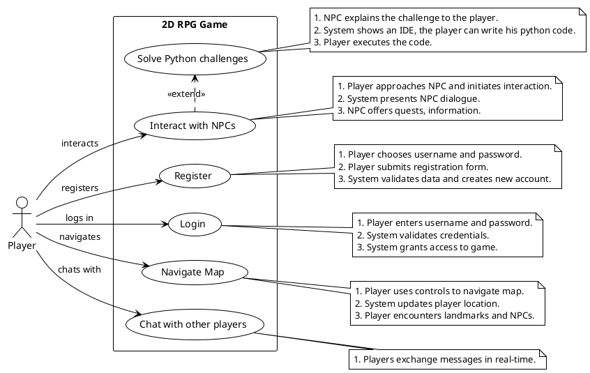
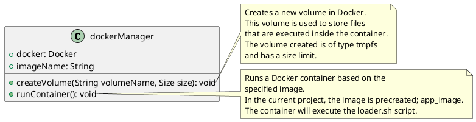
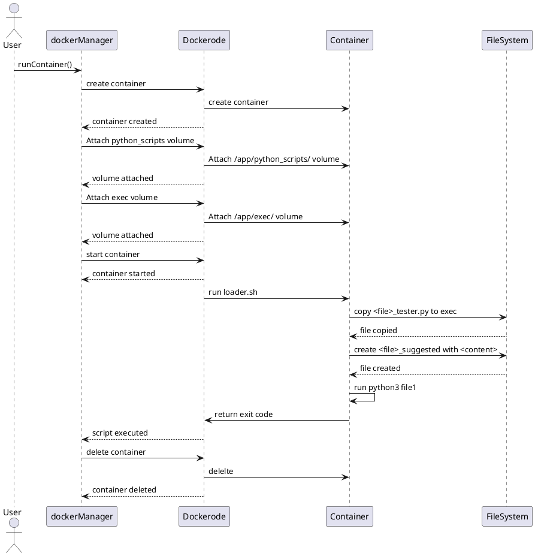
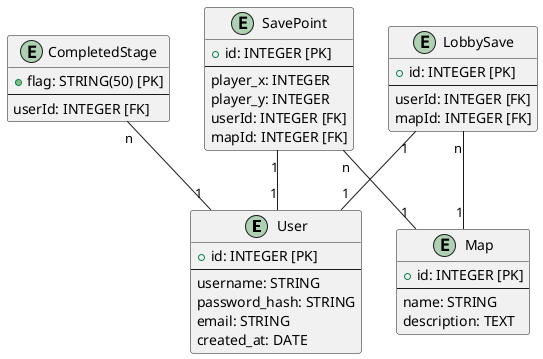

# Projet de Spécialité : INP Legends
## Authors
- [Dehbi Yakoub](https://github.com/dehbiy)
- [Elaasri Youssef](https://github.com/youssef-elaasri)
- [Benabdellah Achraf](https://github.com/benabach)

## Encadrant
- [Sebastien VIARDOT](https://gricad-gitlab.univ-grenoble-alpes.fr/viardots)

## Description
Ce document présente un compte rendu d'un projet de spécialité web. En bref, c'est un RPG 2D où le joueur doit résoudre des défis de programmation en Python. Nous présentons dans ce rapport un cahier des charges et notre implémentation correspondante.

# Table des matières

# Description du Jeu
<!-- Expliquer brièvement l'atmosphère du jeu -->

# Cahier des Charges
## Cas d'Usages

## Diagrammes Séquentielles

# Architecture

## Frontend
<!-- Description du frontend ... -->
### HTML
### CSS
### Classes JS
### Images
### Génération Dynamique des MAPs
<!-- Let Youssef cook ... -->
### Tests
<!-- Expliquer la difficulté de tester un jeu -->

## Backend
<!-- Description du backend -->
### Technologies Utilisées
- Node.js: 
- Express.js:
- Dockerode:
- Sequelize:
- Socket.IO:
### Docker

**DockerManager** est essentiel pour l'exécution des fichiers Python et des tests Unit. Comme son nom l'indique, DockerManager est basé sur Docker et permet d'avoir un environnement isolé sur la machine pour exécuter des programmes.

<!-- diagramme de classes -->

<!-- Digramme de sequence -->

### Python Scripts
<!-- Explication de la gestion des scripts python -->

### Schéma de la Base de Données

<!-- Schéma de la DB -->

### Rest API
<!-- Add routes -->

### Multijoueur
<!-- Expliquer l'intégration des sockets -->

### Securité
<!-- Ecrier comment docker pas sécurisé -->

### Tests
<!-- Couverture de tests backend -->

# Aspects d'amélioration

# Difficultées

# Prospection pour l'avenir

