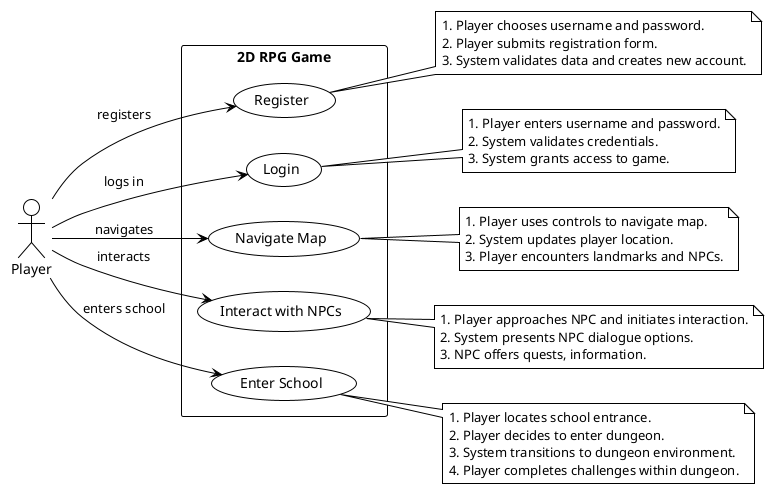

# Projet-filé-RPG-2D

```plantuml
@startuml
!theme plain

left to right direction

actor Player

rectangle "2D RPG Game" {
  usecase UC1 as "Register"
  usecase UC2 as "Login"
  usecase UC3 as "Navigate Map"
  usecase UC4 as "Interact with NPCs"
  usecase UC5 as "Enter School"
}

Player -down-> UC1 : registers
Player -down-> UC2 : logs in
Player -down-> UC3 : navigates
Player -down-> UC4 : interacts
Player -down-> UC5 : enters school

note right of UC1
  1. Player chooses username and password.
  2. Player submits registration form.
  3. System validates data and creates new account.
end note

note right of UC2
  1. Player enters username and password.
  2. System validates credentials.
  3. System grants access to game.
end note

note right of UC3
  1. Player uses controls to navigate map.
  2. System updates player location.
  3. Player encounters landmarks and NPCs.
end note

note right of UC4
  1. Player approaches NPC and initiates interaction.
  2. System presents NPC dialogue options.
  3. NPC offers quests, information.
end note

note right of UC5
  1. Player locates school entrance.
  2. Player decides to enter dungeon.
  3. System transitions to dungeon environment.
  4. Player completes challenges within dungeon.
end note

@enduml

```
