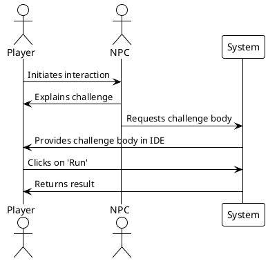
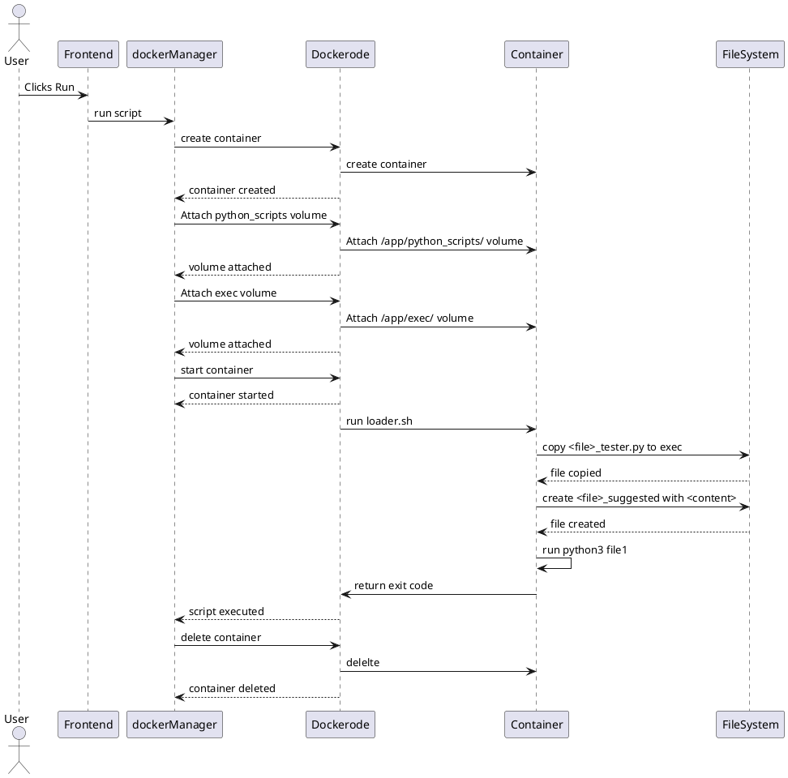

### Projet de Spécialité : INP Legends

## Authors
- [Dehbi Yakoub](https://github.com/dehbiy)
- [Elaasri Youssef](https://github.com/youssef-elaasri)
- [Benabdellah Achraf](https://github.com/benabach)

## Encadrant
- [Sebastien VIARDOT](https://gricad-gitlab.univ-grenoble-alpes.fr/viardots)

## Description
Ce document présente un compte rendu d'un projet de spécialité web. En bref, c'est un RPG 2D où le joueur doit résoudre des défis de programmation en Python. Nous présentons dans ce rapport un cahier des charges et notre mise en œuvre correspondante.

# Table des matières
- [Cahier des Charges](#cahier-des-charges)
  - [Description du Jeu](#description-du-jeu)
  - [Cas d'Usages](#cas-dusages)
  - [Diagrammes Séquentiels](#diagrammes-séquentiels)
- [Notre Avancement](#notre-avancement)
- [Architecture du Projet](#architecture-du-projet)
  - [Frontend](#frontend)
    - [Aperçu](#apercu)
    - [Technologies Utilisées](#technologies-utilisees)
    - [Structure du Projet](#structure-du-projet)
    - [Fonctionnalités Principales](#fonctionnalites-principales)
    - [Logique du Jeu](#logique-du-jeu)
    - [Algorithme d'affichage des objets et des NPC](#algorithme-daffichage-des-objets-et-des-npc)
    - [Algorithme de Génération Dynamique des Maps](#algorithme-de-génération-dynamique-des-maps)
    - [Tests Frontend](#tests-frontend)
  - [Backend](#backend)
    - [Structure](#structure)
    - [Node Scripts](#node-scripts)
    - [Technologies Utilisées](#technologies-utilisees)
    - [Docker](#docker)
    - [Schéma de la Base de Données](#schema-de-la-base-de-donnees)
    - [Rest API](#rest-api)
    - [Multijoueur](#multijoueur)
    - [Sécurité](#securite)
    - [Tests Backend](#tests-backend)
- [CI / CD](#ci--cd)
  - [Intégration](#integration)
  - [Déploiement](#deploiement)
- [Difficultés](#difficultes)
- [Prospection pour l'avenir](#prospection-pour-lavenir)

## Cahier des Charges
### Description du Jeu
Dans "INP Legends", un jeu RPG-2D web qui se déroule dans l'atmosphère de Grenoble INP en l'an 2077, les joueurs sont plongés au cœur d'une épopée futuriste. L'intrigue se déploie autour d'une intelligence artificielle de pointe qui, ayant échappé à ses créateurs, sème le chaos dans le campus.
Conçu comme une expérience éducative immersive, ce jeu invite les joueurs à relever une série de défis de programmation ingénieux. L'objectif est double : neutraliser l'intelligence artificielle rebelle et restaurer la sérénité au sein de l'INP. À travers cette quête, "INP Legends" ne se contente pas de divertir ; il vise à aiguiser les compétences en programmation des joueurs tout en préservant l'équilibre entre éducation et divertissement.

### Cas d'Usages
L'ensemble des cas d'utilisation de notre jeu peuvent être représenté par le diagramme suivant :


### Diagrammes Séquentiels
Voici un diagramme de séquence décrivant l'intéraction avec un NPC.



## Notre Avancement
Nous avons pu couvrir la majorité du cahier des charges. À l'heure actuelle, notre application est capable de générer des cartes dynamiquement, de permettre au joueur de se déplacer, et d'interagir avec des NPCs (personnages non-joueurs) qui peuvent proposer des défis Python, exécuter et évaluer ce code, et enfin sauvegarder la progression du joueur. Le joueur peut, entre autres, se déplacer entre les salles et discuter avec les personnages présents dans ces salles. 

## Architecture du Projet
### Frontend

#### Aperçu

Le frontend de INP Legends est conçu pour offrir une expérience interactive et fluide aux joueurs. Il intègre plusieurs composants clés, notamment une fenêtre de jeu, une fonctionnalité de chat, un panneau de profil joueur et un système d'authentification. L'application utilise des technologies web modernes et des bibliothèques pour assurer une interface utilisateur réactive et engageante.

#### Technologies Utilisées

- **HTML5** pour la structuration de la page web.
- **CSS3** avec des bibliothèques externes comme Pico.css et Font Awesome pour le style.
- **JavaScript** pour le script côté client, incluant divers modules pour gérer la logique du jeu, l'authentification, le chat et le profil joueur.

#### Structure du Projet

##### Fichier `index.html`

Le fichier `index.html` constitue la base de l'application et inclut les éléments suivants :

- **En-tête (`<head>`)** : comprend les liens vers les feuilles de style externes et les polices.
- **Corps (`<body>`)** :
  - **Fenêtre de jeu** : contient le canvas pour afficher le jeu, un panneau de chat, et divers boutons de contrôle (déconnexion, profil, sauvegarde, plein écran).
  - **Panneau de profil** : une section cachée par défaut, affichant les informations du joueur et permettant la modification du mot de passe.
  - **Modal d'authentification** : une fenêtre modale pour la connexion et l'inscription des utilisateurs.

##### Feuilles de Style

- `src/styles.css` : contient les styles personnalisés pour l'application.

##### Scripts JavaScript

- **Bibliothèques externes** : `socket.io`, `jQuery`, et `Ace Editor`.
- **Scripts personnalisés** :
  - `src/socket.js` : gère la connexion SocketIO.
  - `src/authentication.js` : gère les fonctions d'authentification, comme la connexion et l'inscription.
  - `src/chatManager.js` : gère les fonctionnalités de chat en temps réel.
  - `src/playerProfile.js` : gère l'affichage et la mise à jour des informations du profil joueur.
  - `src/IDE.js` : gère l'IDE intégré pour les fonctionnalités de développement.
  - `src/Utils.js` : contient des fonctions utilitaires.
  - `src/DirectionInput.js` : gère les entrées de direction pour le contrôle du jeu.
  - `src/GameObject.js`, `src/Person.js`, `src/NPC.js`, `src/Sprite.js`, `src/OverworldMap.js`, `src/OverworldEvent.js`, `src/MainWorld.js`, `src/init.js` : gèrent les différents aspects et objets du jeu.

#### Fonctionnalités Principales

- **Fenêtre de Jeu** : affiche le jeu et permet l'interaction avec le joueur.
- **Chat** : permet aux joueurs de communiquer en temps réel.
- **Profil Joueur** : affiche les informations du joueur et permet la modification du mot de passe.
- **Authentification** : système de connexion et d'inscription sécurisé.
- **Contrôles du Jeu** : inclut des boutons pour sauvegarder le jeu, passer en plein écran, et se déconnecter.
- **Défis python** : affiche un IDE pour permettre à l'utilisateur de saisir un code python.

#### Logique du Jeu

##### Affichage et Navigation

Le jeu est affiché sur un canvas HTML, et la navigation se fait à l'aide des touches directionnelles du clavier. Le joueur peut se déplacer sur la carte, qui est rendue à l'aide de la classe `OverworldMap`.

- **`OverworldMap.js`** : gère la carte du monde. Elle charge les tuiles de la carte et place les objets et les personnages (joueurs et NPC) à leurs positions initiales.
- **`Sprite.js`** : gère les sprites, c'est-à-dire les images des personnages et des objets animés. Elle prend en charge l'animation et le rendu des sprites sur le canvas.
- **`DirectionInput.js`** : capture les entrées directionnelles du clavier et les traduit en mouvements pour le personnage principal.

##### Interaction avec les NPC

Les joueurs peuvent interagir avec les NPC (Personnages Non Joueurs) en s'approchant d'eux et en appuyant sur une touche d'interaction "espace".

- **`Person.js`** : représente un personnage, joueur ou NPC. Elle gère les propriétés de base comme la position, la vitesse et les méthodes de déplacement.
- **`NPC.js`** : hérite de `Person.js` et ajoute des fonctionnalités spécifiques aux NPC, comme les dialogues et les quêtes.
- **`GameObject.js`** : représente un objet dans le jeu. Il peut s'agir d'un objet interactif avec lequel le joueur peut interagir pour obtenir des informations ou déclencher des événements.
- **`OverworldEvent.js`** : gère les événements dans le monde du jeu, comme les interactions avec les objets ou les NPC.
- **`IDE.js`** : gère l'IDE intégré où les joueurs peuvent résoudre des défis de programmation en Python. Il utilise `Ace Editor` pour fournir une interface de codage conviviale.

### Gestion des Objets

Les joueurs peuvent interagir avec des objets dans le monde du jeu. Il y a deux types d'objets dans le jeu :

- **Objets "mounted"** : ils représentent des murs que l'utilisateur ne peut pas traverser (ex : mur, table).
- **Objets non "mounted"** : ils sont traversables (ex : sol, autres joueurs).

### Défis Python

Après une interaction avec des NPC, si l'utilisateur a le droit de jouer le challenge correspondant, un IDE se lance dans le jeu et permet au joueur de saisir un code représentant la solution du challenge. Si l'utilisateur n'a pas encore le droit, l'interaction avec le NPC sera différente et l'IDE ne se lancera pas.

Les interactions avec les NPC évoluent en progressant dans le jeu.

### Initialisation et Monde Principal

Le jeu est initialisé et configuré à l'aide des scripts suivants :

- **`init.js`** : initialise le jeu en configurant les paramètres de base et en lançant le moteur de jeu.
- **`MainWorld.js`** : gère le monde principal du jeu, en coordonnant les différentes cartes et en contrôlant les transitions entre elles.

### Algorithme d'Affichage des Objets et des NPC

#### Fonction `updateMap()`

La fonction `updateMap()` vérifie si le prochain déplacement du joueur doit déclencher un changement de carte. Si c'est le cas, elle gère les différents cas de changement de carte.

Elle récupère la nouvelle carte et les nouvelles coordonnées à partir de `changeMap`, une table de hachage associant les coordonnées du joueur à la carte et aux coordonnées de destination. Si aucune nouvelle carte n'est trouvée, la fonction se termine.

Ensuite, la fonction met à jour la carte et la position du joueur en appelant `updateMapAndPlayerPosition()`, qui change également la carte affichée et déplace le joueur.

Avant de changer de carte, la fonction peut sauvegarder la partie et émettre un message au serveur via un socket pour informer les autres joueurs. Cette logique est encapsulée dans `saveAndEmit()`.

Des blocs `try` et `catch` gèrent les erreurs potentielles. Les différents cas de changement de carte incluent l'entrée et la sortie du hall (`lobby`).

#### Fonction `startGameLoop()`

La fonction `startGameLoop()` est le cœur de la boucle de jeu. Elle actualise et rend tous les éléments visibles à l'écran, y compris les objets et les NPC.

Elle commence par effacer le canvas à chaque itération, puis met à jour la carte de jeu avec `updateMap()`.

Elle met à jour chaque objet de jeu, NPC et joueur, puis les dessine sur le canvas. Les objets et NPC "supérieurs" sont dessinés après les autres éléments pour un rendu correct.

#### Méthode `draw(ctx)` de la Classe `Sprite`

La méthode `draw(ctx)` dessine un objet ou un NPC sur le canvas en fonction de sa position et de son état actuels par rapport au joueur principal.

Elle calcule les coordonnées de rendu et dessine l'image correspondante sur le canvas. Si l'objet doit être dessiné au-dessus des autres éléments, il est ajouté à `window.upperObjects` pour un rendu ultérieur.

### Algorithme de Génération Dynamique des Maps

#### Fonction `init(userId)`

La fonction `init()` initialise le jeu pour un utilisateur donné. Elle charge l'état du jeu, initialise le joueur, crée et prépare les objets et les cartes, démarre la carte initiale, capture les entrées directionnelles, initialise le multijoueur, et démarre la boucle de jeu.

#### Fonction `prepareMAP(mapName, src)`

La fonction `prepareMAP()` prépare une carte spécifique en chargeant son image, en assurant le chargement asynchrone avec `crossOrigin`, puis en appelant `util.crateMap(mapName, levelImage)`.

#### Fonction `crateMap(mapName, image)`

La fonction `crateMap()` convertit une image de carte en objets de jeu placés sur la carte. Elle crée un canevas hors écran, dessine l'image dessus, extrait les données d'image, parcourt chaque pixel pour lire les valeurs RGB, et ajoute des objets à la carte en fonction des couleurs spécifiques.

#### Fonction `addObject(mapName, object, name, x, y)`

La fonction `addObject()` ajoute un objet spécifique à une carte en fonction des paramètres fournis. Elle est appelée dans `crateMap()` pour chaque pixel correspondant à un objet.


### Tests Frontend
<!-- Expliquer la difficulté de tester un jeu -->
Pour les tests Frontend, nous nous limitons aux tests `Cypress` pour la partie authentification et affichage des îcones etc... 
Nous n'avons pas trouvé de méthode simple pour tester la partie jouabilité.

## Backend
### Structure
- **Répertoires principaux** :
  - **images/** : Contient les fichiers d'image utilisés par l'application.
  - **models/** : Contient les définitions des modèles de données pour Sequelize.
  - **multiplayer/** : Contient les scripts de gestion des fonctionnalités multijoueurs.
  - **python_scripts/** : Contient tous les documents nécessaire pour tester les challenges. Pour les tests, on utilise la bibliothèque Python `unittest`.
  - **routes** : Contient les définitions des routes API.

- **Fichiers principaux** :
  - `.env` : Fichier de configuration des variables d'environnement.
  - `app.js` : Point d'entrée principal de l'application, configure Express.js et les middlewares.
  - `init-database.js` : Initialise la base de données avec Sequelize.
  - `server.js` : Configure et démarre le serveur HTTP et Socket.IO.

<!-- Description du backend -->

### Node Scripts
- rebuild-image: permet de créer une image **app_image** si elle n'existe pas.
- init:reset: permet d'initier la base de données et la repeupler.
- setup: C'est le premier script qu'il faut lancer en back. Il permet de créer l'image et la base de données pour faire fonctionner le back.
- start: permet de lancer la serveur backend avec **nodemon**
- test: comme son nom l'indique, elle permet de tester back avec jest et d'avoir la couverture des tests.

### Technologies Utilisées
- `Node.js` : est l'environnement d'exécution principal de notre application côté serveur.
- `Express.js` : est le framework web utilisé dans app.js pour créer les API RESTful. Il gère les routes et les requêtes HTTP.
- `Dockerode` : est utilisé dans dockerManager.js pour interagir avec l'API Docker. Il permet de gérer les conteneurs Docker qui exécutent les défis Python soumis par les joueurs, assurant ainsi une isolation et une évaluation sécurisée du code.
- `Sequelize` : est utilisé pour interagir avec notre base de données MySQL. Nous avons choisi d'intégrer Sequelize à notre projet pour faciliter le déploiement.
- `Socket.IO` : gère les événements de jeu en direct, comme les déplacements des joueurs et les discussions en temps réel.
### Docker

**DockerManager** est essentiel pour l'exécution des fichiers Python et des tests Unit. Comme son nom l'indique, DockerManager est basé sur Docker et permet d'avoir un environnement isolé sur la machine pour exécuter des programmes.

<!-- diagramme de classes -->

<!-- Digramme de sequence -->



### Schéma de la Base de Données
Le schéma de la base de données décrit les différentes entités et leurs relations au sein de notre application. Voici un aperçu des tables et de leurs relations :
<!-- Schéma de la DB -->


### Rest API

| Méthode | Route                                 | Description                                                |
|---------|---------------------------------------|------------------------------------------------------------|
| POST    | /register                             | Crée un nouvel utilisateur                                 |
| POST    | /login                                | Authentifie un utilisateur et génère un token              |
| POST    | /api/users/:userId/change-password    | Change le mot de passe d'un utilisateur                    |
| POST    | /python                               | Fetch le corps du défis et le renvoie à l'utilisateur      |
| POST    | /python_script                        | Exécute un script Python à partir d'un fichier             |
| GET     | /api/users/:userId/load               | Charge l'état du jeu pour l'utilisateur spécifié           |
| POST    | /api/users/:userId/save               | Sauvegarde l'état du jeu pour l'utilisateur spécifié       |
| GET     | /api/users/:userId/loadLobby          | Charge la dernière carte avant la sortie du lobby          |
| POST    | /api/users/:userId/saveLobby          | Sauvegarde la carte actuelle avant l'entrée en lobby       |

### Multijoueur
<!-- Expliquer l'intégration des sockets -->
L'intégration des sockets dans notre application permet une communication en temps réel entre les joueurs, essentielle pour les fonctionnalités multijoueurs. Nous utilisons Socket.IO pour gérer cette communication bidirectionnelle de manière efficace et fiable.
Les événements de jeu en temps réel sont :
  - `registerNewPlayer` : Enregistre les données d'un joueur à sa connexion et notifie les autres joueurs sur la même carte. Ses données enregistrées en backend permetteront d'avoir **au maximum une seule session active par compte**.
  - `updatePosition` : Met à jour la position du joueur et informe les autres joueurs **sur la même carte**.
  - `changeMap` : Gère les changements de carte des joueurs et met à jour les salles correspondantes en notifiant les joueurs de chaque carte.
  - `sendMessage` : Permet aux joueurs d'une même salle d'envoyer des messages en temps réel.
  - `disconnect`: Lorsqu'un joueur se déconnecte, nous supprimons ses informations et notifions les autres joueurs de sa déconnexion.

### Securité
<!-- Ecrier comment docker pas sécurisé -->
La conteneurisation avec Docker constitue la principale couche de sécurité. En effet, cette dernière assure une isolation du code Python exécuté du système. Le conteneur lui-même est sécurisé : l'utilisateur n'a pas le droit d'écrire dans le conteneur, à l'exception du dossier dédié à l'exécution */app/exec*. Ce dossier même est limité en taille, ce qui garantit que les programmes exécutés ne consomment pas excessivement de ressources mémoire.

```js
createVolume(volumeName, size){
  const volumeOptions = {
                        Name: volumeName,
                        Driver: 'local',
                        DriverOpts: {
                            'type': 'tmpfs', //  Système de fichiers Unix temporaire
                            'device': 'tmpfs',
                            'o': `size=${size}` // La taille maximale
                        }
                    };
  // etc...
}
```

**Diagrame de sequence** pour les différents scènarios


Un script malveillant peut cependant exploiter une faille de sécurité[^1] dans Docker. Un contenair enregistre tous les logs dans un fichier *.json* et les stocke en mémoire tant que le contenaor est en vie. Une boucle infinie, par exemple, qui effectue des impressions peut consommer toute la mémoire de la machine hôte[^2]. Pour remédier à cela, nous limitons la taille du fichier de log à *10 MB*. De plus, tous les testes python impose une limite de temps de 10 secondes.

[^1]: Ce n'est pas une faille de sécurité, mais plutôt le comportement par défaut des conteneurs Docker.
[^2]: Nous avons sacrifié une machine pour découvrir ce bug. Merci à Achraf :' )


```js
  runContainer(scriptName, path, content, volumeName) {
    const containerOptions = {
                Image: this.image,
                Cmd: [`${scriptName}_tester.py`, `${scriptName}_suggested.py`, content],
                AttachStdout: true,
                AttachStderr: true,
                HostConfig:{
                    LogConfig: {
                        Type: 'json-file',
                        config:{
                            'max-size': '10b', // 10o est le maximum pour un fichier log
                            'max-file': '1' // Nous avons un seul fichier log
                        }
                    },
                    Binds:  [
                        `${process.cwd()}/${path}:/app/python_scripts`,
                        `${volumeName}:/app/exec`
                    ]
                }
            };
  }
```


### Tests Backend
Nous avons utilisé `Jest` et `SuperTest` pour tester notre backend, en couvrant différents aspects de l'application. Nous avons spécifiquement pu testé les routes liées à l'utilisateur et aux sauvegardes. Celles liées à Docker n'ont été testées que manuellement.

## CI / CD
### Intégration 
L'intégration continue (CI) est mise en place pour garantir que le code de notre application est constamment testé et analysé pour des erreurs potentielles. Nous utilisons plusieurs étapes pour linting, tester, et construire notre application.

  - Linting : Nous vérifions la qualité du code avec des outils comme ESLint pour les fichiers JavaScript, HTMLHint pour les fichiers HTML, et CSSLint pour les fichiers CSS. Cela nous aide à maintenir un code propre et cohérent.

  - Tests : Nous vérifions le bon fonctionnement de notre code en le passant par un stage de test. Nous utilisons `Jest` et `SuperTest` pour le backend, et `Cypress` pour quelques aspects du frontend.

  - Build : Nous avons des étapes pour construire le backend (commentées pour l'instant) et le frontend de l'application. Cela permet de compiler notre code et de préparer les artefacts nécessaires pour le déploiement.

### Déploiement
Le déploiement de l'application n'a malheureusement pas pu être réalisé. Notre application exécute du code Python dans des conteneurs Docker, ce qui a rendu difficile la recherche d'un service gratuit d'hébergement. Nous avons trouvé des pistes de solutions, comme par exemple créer une image Docker de notre serveur Node.js et la déployer sur un service cloud, mais nous n'avions pas le temps de découvrir cette piste.

## Difficultées
- L'api du docker n'est pas évidente et peut introduire des failles de sécurité.
- Il est difficile de tester la partie frontend pour un rpg en 2d.
- Dessiner des maps n'est pas evident, surtout pour trouver des beaux graphique et faire du game design moderne. Nous avons fait le choix de ne pas trop prendre les graphiques de jeu déja existant. Cela dit, la [generation dynamique](#algorithme-de-génération-dynamique-des-maps) de la map nous a bien facilité la tache.

## Prospection pour l'avenir pour notre jeu

Pour l'avenir on peut améliorer les graphismes et l'interface utilisateur, on peut même créer nos propres sprites pour éviter les problèmes de licence. On peut aussi expander le monde de jeu pour avoir plus de cartes et de défis. Et on peut essayer d'optimiser nos algorithmes pour des meilleures performances.


